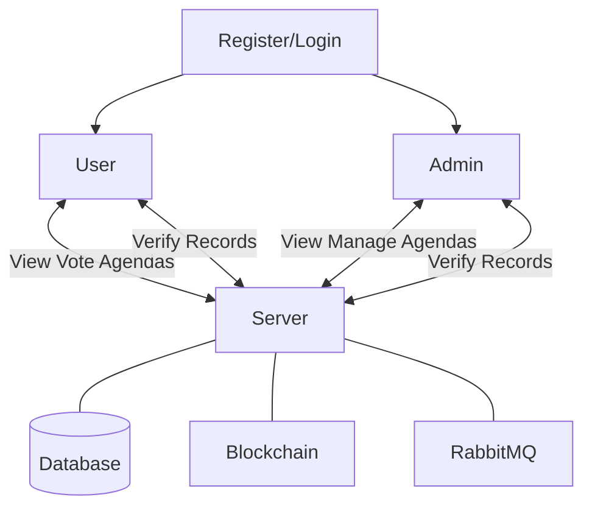
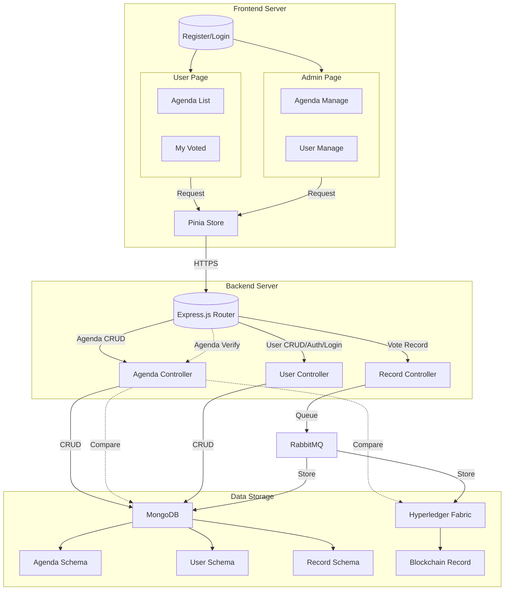
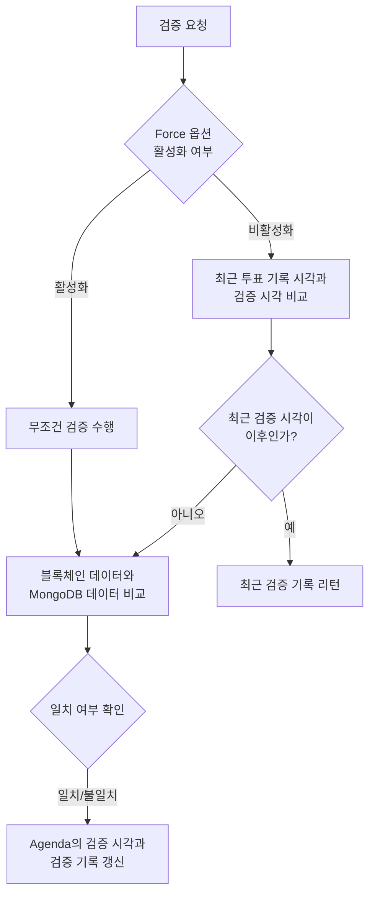
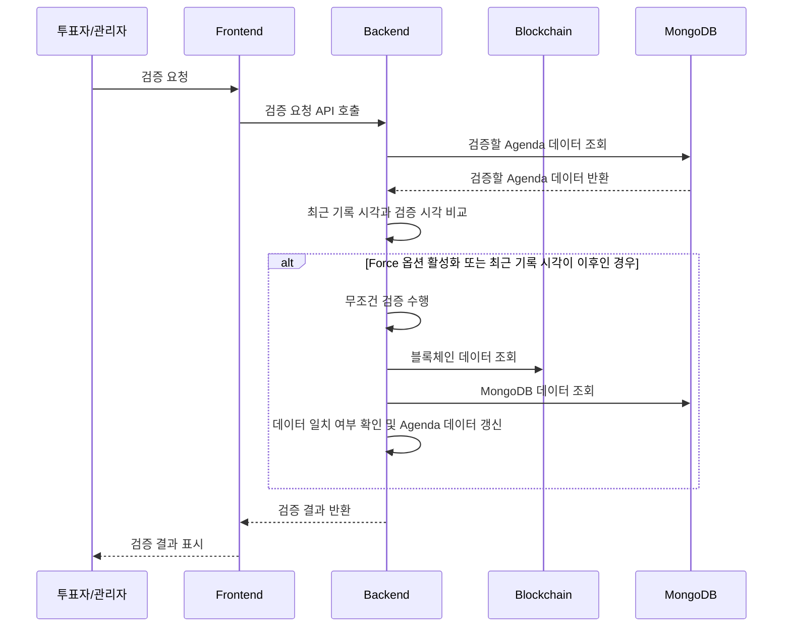
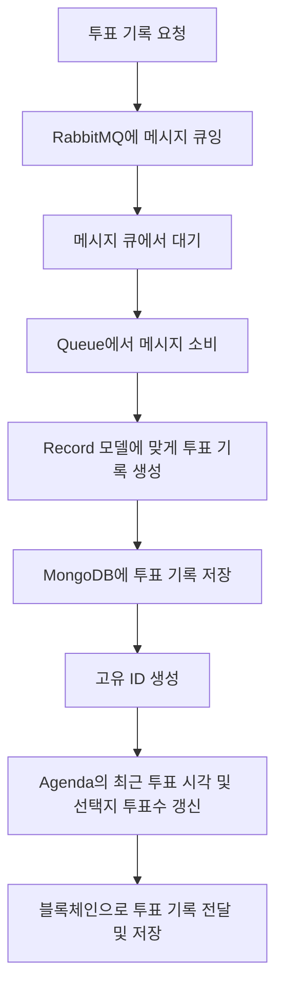
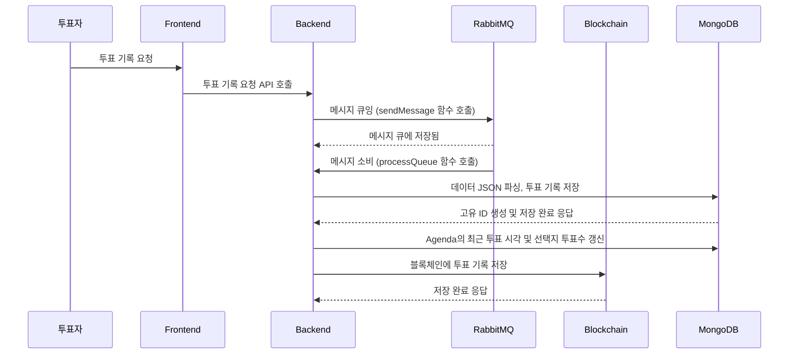


# Usage Documentation

## Basic Usage
### Starting the Blockchain Network
Refer to the [Hyperledger Fabric documentation](https://hyperledger-fabric.readthedocs.io/en/release-2.5/test_network.html) for details. To start the network, navigate to the test network directory and execute the script:
```Shell
cd ~/ovote/fabric-samples/test-network
./network.sh up createChannel -ca
```
You can specify a custom channel name using the `-c` option. The default channel name is 'mychannel'. For example:
```Shell
./network.sh createChannel -c channel1
```

### Deploying Chaincode on the Blockchain Network
Deploy chaincode using the following command:
```Shell
./network.sh deployCC -ccn ovote -ccp ../../chaincode -ccl go
```
- `-ccn`: Chaincode name
- `-ccp`: Chaincode path
- `-ccl`: Chaincode language

### Starting the RabbitMQ Server
For macOS:
```Shell
rabbitmq-server
```

For WSL Ubuntu 22.04 LTS:
```Shell
sudo systemctl start rabbitmq-server
sudo systemctl enable rabbitmq-server
```

### Running the Backend Server
Navigate to the backend server directory and start the server:
```Shell
cd ~/ovote/backend-server
npm run dev
```

### Running the Frontend Server
Navigate to the frontend server directory and start the server:
```Shell
cd ~/ovote/frontend-server
npm run dev
```

## Advanced Features
### Use Case


1. **User Registration/Login**:
   - Users register with hashed passwords stored in the database.
   - Login credentials are verified against the stored hashed passwords.

2. **Agenda Management (Admin)**:
   - Admins can create, modify, and delete agendas, except for those in progress or completed.

3. **Voting Process (User)**:
   - Users view and vote on active agendas.
   - Votes are encrypted and stored as blockchain transactions.
   - Transactions are queued in RabbitMQ and processed asynchronously.
   - Votes are anonymously recorded in the database using hashed orgID and salt.

4. **Verification**:
   - Users and admins can verify content by comparing database records with blockchain records.

## Visual Aids

### Dataflow Component Diagrams


verifyAgendaConsistency 메소드 흐름도



검증요청시의 데이터흐름


createRecord 메소드 흐름도


rabbitMQ메시지 처리 흐름도

